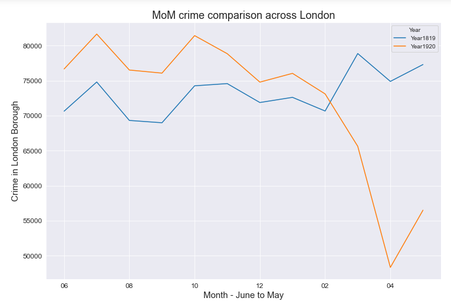
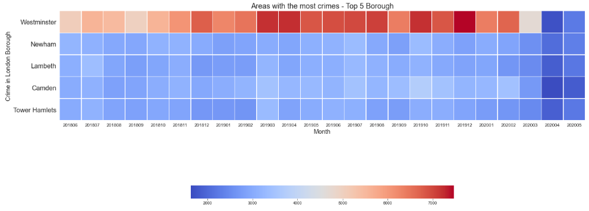
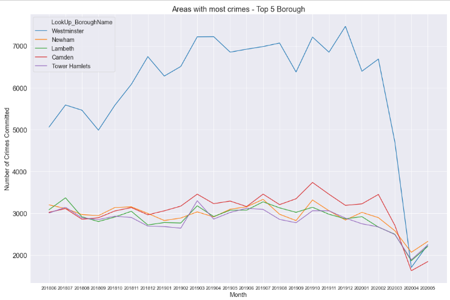
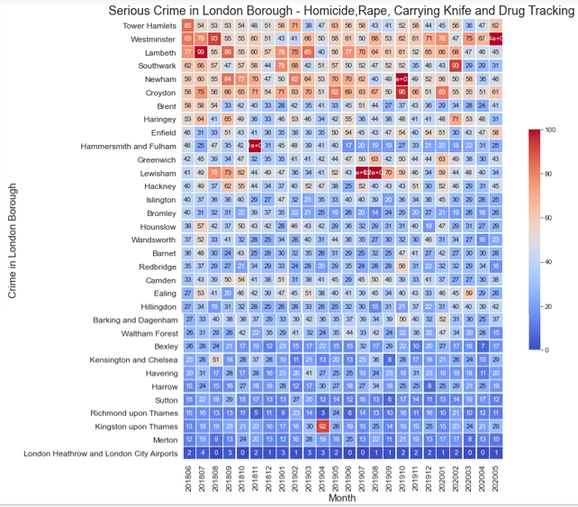
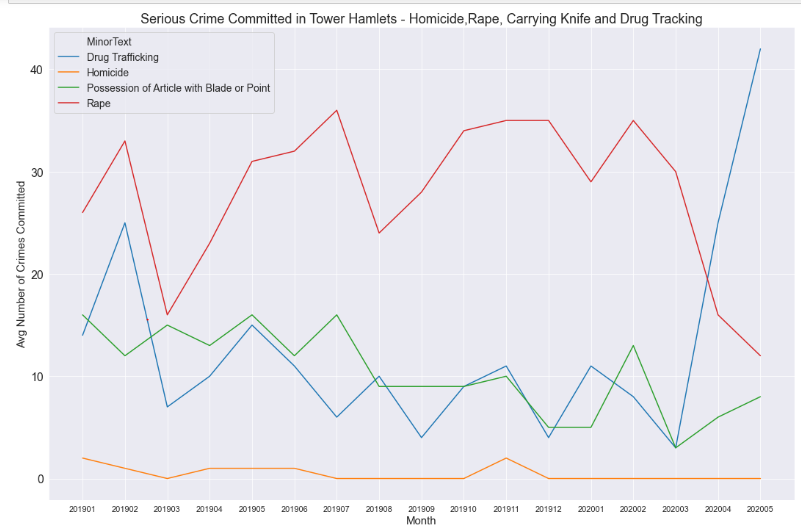

# London Borough Crime: Data Analysis Project
London has 33 boroughs and its one of the most busiest place in the UK. I will be using the data set to explore the type of crimes that been committed and the areas they tend to take place.

1 - Carried out EDA on crime data set across London for the last 24 months and finding the areas where the most crime is committed.

2.0 - Built a dashboard for London Crime in the last two years on Streamlit platform which is free and easy to share with stakeholders.

2.1 - Built a client facing API and Heroku to view the dashboard on [Streamlit](https://londoncrime.herokuapp.com/).

3.0 - I will be using the crime data set from June 2018 to May 2020 and forecast the crimes committed in London for the next 12 months using Seasonal ARIMA model.

# 1. Data Cleaning and EDA

# Insights
- From the heat map we can see Minor crimes are the most common crimes that have been committed across London such as theft, burglary and violence. There is pattern in Theft from a Motor Vehicle in Winter from Aug 2019 to Dec 2019.
- Crime has decrease by -1.5% from Year1819 to Year1920.
- Crime was 27% down from March to April 2020.
- Crime was 35% down when comparing with April 2019 vs April 2020
- Crime was 27% down when comparing with May 2019 vs May 2020
- Firearm Offences has increase by 300% and which could be correlated with Possession of Drugs or Homicide.
- Possession of Blade has decrease by 15% from last year, this could be due to stop and search policy relaunched in London.
- On Average 5000+ crime cases are register in Westminster each Month and the closes borough to that is Newham with 3000+ cases registered on average.
- Only serious crime has increased in Westminister such as Drug Trafficking by 148%. Shoplifting and Motor Vehicle crime has decreased by 15% to 20%.
- Majority of the London Borough averages about 10 serious crimes cases each month.However from the heat map we can see some of the borough are averaging about 50 serious crime cases each month.Tower Hamlets has the most serious crime cases committed each month.
- Tower Hamlets has 25 rape cases on average each month however since covid 19 it has decreased. But Knife crime has increased since covid 19.

# [2. Streamlit Dashboard](https://londoncrime.herokuapp.com/)

Streamlit is a platform that allows users to build ML Dashboard, so for my project I created a dashboard for London crime in the last two years.

# [3. Forecasting - Seasonal ARIMA]()
